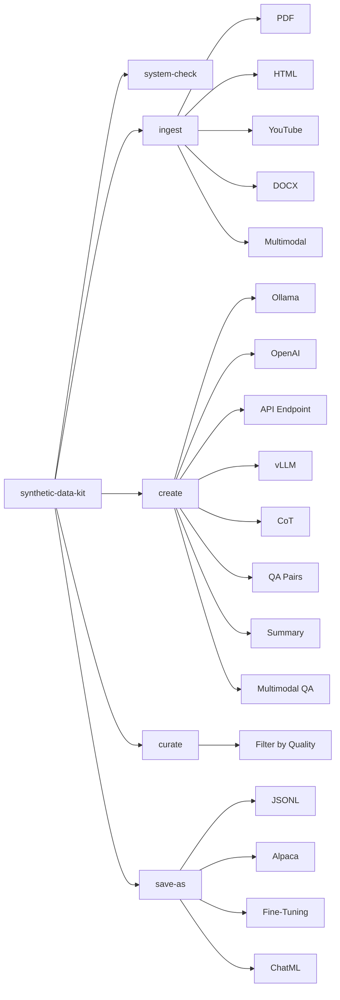

# Synthetic Data Kit

A powerful CLI tool for generating high-quality synthetic datasets to fine-tune Large Language Models (LLMs). Easily create reasoning traces, QA pairs, and convert them into fine-tuning formats.

[](https://github.com/meta-llama/synthetic-data-kit)
[](LICENSE)

## Table of Contents

- [Overview](#overview)
- [Key Features](#key-features)
- [Installation](#installation)
- [Quick Start](#quick-start)
- [Usage](#usage)
  - [System Check](#system-check)
  - [Ingest](#ingest)
  - [Create](#create)
  - [Curate](#curate)
  - [Save As](#save-as)
- [Configuration](#configuration)
- [Examples](#examples)
- [Document Processing & Chunking](#document-processing--chunking)
- [Advanced Usage](#advanced-usage)
- [Troubleshooting](#troubleshooting)
- [Testing and Demos](#testing-and-demos)

## Overview

Fine-tuning LLMs is straightforward with mature tools available for the Llama model family. However, preparing your data in the right format can be challenging. Synthetic Data Kit simplifies this by:

- Using LLMs (Ollama, OpenAI, or custom API endpoints) to generate examples
- Providing a modular 4-command workflow
- Converting existing files into fine-tuning-friendly formats
- Supporting various post-training formats

The toolkit follows a simple CLI structure with 4 main commands:
- `ingest`: Parse various file formats
- `create`: Generate fine-tuning data (QA pairs, CoT reasoning, summaries)
- `curate`: Filter high-quality examples using LLM-as-a-judge
- `save-as`: Convert to your preferred fine-tuning format

## Key Features

- **Multi-Provider Support**: Ollama, OpenAI, vLLM, and custom API endpoints
- **File Format Support**: PDF, HTML, DOCX, PPTX, TXT, YouTube transcripts
- **Data Types**: QA pairs, Chain-of-Thought reasoning, Multimodal QA
- **Batch Processing**: Handle entire directories of files
- **Intelligent Chunking**: Automatic handling of large documents
- **Quality Curation**: LLM-powered filtering for high-quality data
- **Multiple Output Formats**: Alpaca, ChatML, JSONL, OpenAI Fine-Tuning
- **Preview Mode**: See what files will be processed before running
- **Flexible Configuration**: YAML-based config with CLI overrides

## Installation

### From PyPI (Recommended)

```bash
# Create a virtual environment
conda create -n synthetic-data python=3.10
conda activate synthetic-data

# Install the package
pip install synthetic-data-kit
```

### From Source

```bash
# Clone the repository
git clone https://github.com/meta-llama/synthetic-data-kit.git
cd synthetic-data-kit

# Install in development mode
pip install -e .
```

### Dependencies

Install additional dependencies based on your needs:

```bash
# For PDF processing
pip install pdfminer.six

# For HTML processing
pip install beautifulsoup4

# For YouTube transcripts
pip install pytubefix youtube-transcript-api

# For Office documents
pip install python-docx python-pptx

# For enhanced JSON parsing
pip install json5
```

## Quick Start

1. **Set up your environment:**
   ```bash
   # Create data directories
   mkdir -p data/{input,parsed,generated,curated,final}
   ```

2. **Choose your LLM provider:**
   - **Ollama** (Local, recommended):
     ```bash
     curl -fsSL https://ollama.ai/install.sh | sh
     ollama pull llama3.2:3b
     ```
   - **OpenAI**:
     ```bash
     export OPENAI_API_KEY="your-api-key-here"
     ```
   - **vLLM**:
     ```bash
     pip install vllm
     vllm serve meta-llama/Llama-3.3-70B-Instruct --port 8000
     ```

3. **Process your first document:**
   ```bash
   # Check system
   synthetic-data-kit system-check --provider ollama

   # Ingest and process
   synthetic-data-kit ingest research_paper.pdf
   synthetic-data-kit create data/parsed/research_paper.txt --type qa
   synthetic-data-kit curate data/generated/research_paper_qa_pairs.json
   synthetic-data-kit save-as data/curated/research_paper_cleaned.json --format alpaca
   ```

## LLM Providers & Models

Synthetic Data Kit supports multiple LLM providers with flexible model selection:

### Supported Providers

- **Ollama** (Local, recommended for privacy)
- **OpenAI** (Cloud, high quality)
- **vLLM** (Local inference server)
- **API Endpoint** (Custom/compatible APIs)

### Provider Setup

#### Ollama (Recommended)
```bash
# Install Ollama
curl -fsSL https://ollama.ai/install.sh | sh

# Pull recommended models
ollama pull llama3.2:3b      # Fast, good quality
ollama pull llama3.1:8b      # Better quality, slower
ollama pull mistral:7b       # Alternative option

# Use in toolkit
synthetic-data-kit create document.txt --provider ollama --model llama3.2:3b
```

#### OpenAI
```bash
# Set API key
export OPENAI_API_KEY="your-api-key-here"

# Use in toolkit
synthetic-data-kit create document.txt --provider openai --model gpt-4o
synthetic-data-kit create document.txt --provider openai --model gpt-3.5-turbo
```

#### vLLM
```bash
# Install vLLM
pip install vllm

# Start server
vllm serve meta-llama/Llama-3.3-70B-Instruct --port 8000

# Use in toolkit
synthetic-data-kit create document.txt --provider vllm --model meta-llama/Llama-3.3-70B-Instruct
```

#### Custom API Endpoint
```bash
# Use any OpenAI-compatible API
synthetic-data-kit create document.txt --provider api-endpoint --model your-model-name
```

### Model Recommendations

| Use Case | Ollama Model | OpenAI Model | Performance |
|----------|-------------|--------------|-------------|
| Quick testing | `llama3.2:3b` | `gpt-3.5-turbo` | Fast, good quality |
| High quality | `llama3.1:8b` | `gpt-4o` | Slower, best quality |
| Local only | `mistral:7b` | N/A | Good balance |

## Usage

### System Check

Verify your LLM provider is working:

```bash
# Check Ollama
synthetic-data-kit system-check --provider ollama

# Check OpenAI
synthetic-data-kit system-check --provider openai

# Check vLLM
synthetic-data-kit system-check --provider vllm
```

### Ingest

Parse documents into a processable format:

```bash
# Single file
synthetic-data-kit ingest document.pdf

# Directory (batch processing)
synthetic-data-kit ingest ./documents/

# YouTube video
synthetic-data-kit ingest "https://www.youtube.com/watch?v=VIDEO_ID"

# Multimodal (extract text and images)
synthetic-data-kit ingest document.pdf --multimodal

# Preview mode
synthetic-data-kit ingest ./documents/ --preview
```

**Supported formats:** PDF, HTML, DOCX, PPTX, TXT, YouTube URLs

### Create

Generate synthetic data from parsed documents:

```bash
# QA pairs
synthetic-data-kit create data/parsed/document.txt --type qa --num-pairs 30

# Chain-of-Thought reasoning
synthetic-data-kit create data/parsed/document.txt --type cot --num-pairs 20

# Multimodal QA (requires multimodal ingest)
synthetic-data-kit create data/parsed/document.lance --type multimodal-qa

# Directory processing
synthetic-data-kit create ./data/parsed/ --type qa --num-pairs 50

# Custom chunking
synthetic-data-kit create document.txt --type qa --chunk-size 2000 --chunk-overlap 100

# Using different providers
synthetic-data-kit create document.txt --type qa --provider ollama --model llama3.2:3b
synthetic-data-kit create document.txt --type qa --provider openai --model gpt-4o
synthetic-data-kit create document.txt --type qa --provider vllm --model meta-llama/Llama-3.3-70B-Instruct
synthetic-data-kit create document.txt --type qa --provider api-endpoint --model your-custom-model
```

**Options:**
- `--type`: `qa`, `cot`, `multimodal-qa`
- `--num-pairs`: Number of pairs to generate
- `--chunk-size`: Text chunk size (default: 4000)
- `--chunk-overlap`: Overlap between chunks (default: 200)
- `--provider`: LLM provider (`ollama`, `openai`, `vllm`, `api-endpoint`)
- `--model`: Specific model to use (provider-dependent)
- `--verbose`: Show detailed progress

### Curate

Filter generated data for quality using LLM-as-a-judge:

```bash
# Single file
synthetic-data-kit curate data/generated/qa_pairs.json --threshold 8.0

# Directory processing
synthetic-data-kit curate ./data/generated/ --threshold 7.5

# Custom batch size
synthetic-data-kit curate qa_pairs.json --batch-size 16
```

**Options:**
- `--threshold`: Quality threshold (0-10, default: 7.0)
- `--batch-size`: Processing batch size (default: 8)
- `--provider`: LLM provider (`ollama`, `openai`, `vllm`, `api-endpoint`)
- `--model`: Specific model to use (provider-dependent)

### Save As

Convert curated data to fine-tuning formats:

```bash
# Alpaca format
synthetic-data-kit save-as data/curated/cleaned.json --format alpaca

# ChatML format
synthetic-data-kit save-as data/curated/cleaned.json --format chatml

# OpenAI fine-tuning format
synthetic-data-kit save-as data/curated/cleaned.json --format ft

# Hugging Face dataset
synthetic-data-kit save-as data/curated/cleaned.json --format ft --storage hf

# Directory processing
synthetic-data-kit save-as ./data/curated/ --format alpaca
```

**Supported formats:**
- `alpaca`: Alpaca instruction format
- `chatml`: ChatML conversation format
- `ft`: OpenAI fine-tuning format
- `jsonl`: JSON Lines format

**Storage options:**
- `json`: JSON file (default)
- `hf`: Hugging Face dataset

## Configuration

The toolkit uses YAML configuration files. Default: `configs/config.yaml`

### Basic Configuration

```yaml
# LLM Provider Configuration
llm:
  provider: "ollama"  # or "openai", "api-endpoint", "vllm"

# Provider-specific settings
ollama:
  api_base: "http://localhost:11434"
  model: "llama3.2:3b"
  sleep_time: 0.1

openai:
  api_base: "https://api.openai.com/v1"
  api_key: "sk-your-openai-api-key"
  model: "gpt-4o"
  sleep_time: 0.5

# Generation settings
generation:
  temperature: 0.7
  chunk_size: 4000
  num_pairs: 25
  max_context_length: 8000

# Curation settings
curate:
  threshold: 7.0
  batch_size: 8
```

### Custom Configuration

Create a custom config file and use it with the `-c` flag:

```bash
synthetic-data-kit -c my_config.yaml ingest document.pdf
```

### Custom Prompt Templates

Override default prompts in your config:

```yaml
prompts:
  qa_generation: |
    You are creating question-answer pairs for fine-tuning a {domain} assistant.
    Focus on {focus_areas}.
    
    Create {num_pairs} high-quality question-answer pairs based ONLY on this text.
    
    Return ONLY valid JSON formatted as:
    [
      {{
        "question": "Detailed question?",
        "answer": "Precise answer."
      }},
      ...
    ]
    
    Text:
    ---
    {text}
    ---
```

## Examples

### Single Document Processing

```bash
# Complete workflow for one PDF
synthetic-data-kit ingest research_paper.pdf
synthetic-data-kit create data/parsed/research_paper.txt --type qa -n 30
synthetic-data-kit curate data/generated/research_paper_qa_pairs.json -t 8.5
synthetic-data-kit save-as data/curated/research_paper_cleaned.json --format ft
```

### Batch Directory Processing

```bash
# Process all documents in a directory
synthetic-data-kit ingest ./research_papers/
synthetic-data-kit create ./data/parsed/ --type qa -n 50
synthetic-data-kit curate ./data/generated/ --threshold 8.0
synthetic-data-kit save-as ./data/curated/ --format alpaca --storage hf
```

### Chain-of-Thought Reasoning

```bash
# Generate reasoning traces
synthetic-data-kit ingest technical_doc.pdf
synthetic-data-kit create data/parsed/technical_doc.txt --type cot --num-pairs 20
synthetic-data-kit curate data/generated/technical_doc_cot.json --threshold 9.0
synthetic-data-kit save-as data/curated/technical_doc_cot.json --format chatml
```

### Multimodal Processing

```bash
# Extract text and images
synthetic-data-kit ingest report.pdf --multimodal
synthetic-data-kit create data/parsed/report.lance --type multimodal-qa
```

### Preview Mode

```bash
# See what will be processed
synthetic-data-kit ingest ./documents/ --preview
synthetic-data-kit create ./data/parsed/ --preview --verbose
```

## Document Processing & Chunking

### How Chunking Works

The toolkit automatically handles documents of any size:

- **Small documents** (< 8000 characters): Single API call
- **Large documents** (≥ 8000 characters): Split into chunks with overlap

### Chunking Parameters

| Parameter | Default | Description |
|-----------|---------|-------------|
| `--chunk-size` | 4000 | Characters per chunk |
| `--chunk-overlap` | 200 | Overlap between chunks |
| `--verbose` | false | Show chunking progress |

### Custom Chunking

```bash
# Single file
synthetic-data-kit create large_doc.txt --type qa --chunk-size 2000 --chunk-overlap 100 --verbose

# Directory
synthetic-data-kit create ./data/parsed/ --type cot --chunk-size 6000 --verbose
```

### Understanding Output

With `--verbose`, you'll see:

```
Generating QA pairs...
Document split into 8 chunks
Processing 8 chunks to generate QA pairs...
  Generated 3 pairs from chunk 1 (total: 3/20)
  Generated 2 pairs from chunk 2 (total: 5/20)
  ...
Generated 20 QA pairs total (requested: 20)
```

## Advanced Usage

### Mental Model



### Custom Domain Adaptation

Adapt prompts for specific domains:

```yaml
prompts:
  qa_generation: |
    You are creating question-answer pairs for fine-tuning a legal assistant.
    Focus on technical legal concepts, precedents, and statutory interpretation.
    
    Create {num_pairs} high-quality question-answer pairs based ONLY on this text.
    
    Return ONLY valid JSON formatted as:
    [
      {{
        "question": "Detailed legal question?",
        "answer": "Precise legal answer."
      }},
      ...
    ]
    
    Text:
    ---
    {text}
    ---
```

### Legacy Directory Structure

The toolkit still supports the legacy structure:

```bash
mkdir -p data/{pdf,html,youtube,docx,ppt,txt,output,generated,cleaned,final}
```

## Troubleshooting

### Common Issues

#### Ollama Issues
- **Installation**: `curl -fsSL https://ollama.ai/install.sh | sh`
- **Model**: `ollama pull llama3.2:3b`
- **Server**: `ollama list`
- **API Check**: `curl http://localhost:11434/api/tags`

#### OpenAI Issues
- **API Key**: `export OPENAI_API_KEY="your-key"`
- **Validation**: `synthetic-data-kit system-check --provider openai`
- **Usage**: Check at https://platform.openai.com/usage

#### vLLM Issues
- **Installation**: `pip install vllm`
- **Server**: `vllm serve <model_name> --port 8000`
- **Connection**: `synthetic-data-kit system-check --provider vllm`

#### Memory Issues
- Use smaller models (e.g., `llama3.2:3b`)
- Reduce batch size in config
- For vLLM: `vllm serve <model> --gpu-memory-utilization 0.85`

#### JSON Parsing Issues
- Enable verbose: `synthetic-data-kit curate file.json -v`
- Reduce batch size
- Ensure LLM supports JSON output
- Install: `pip install json5`

#### Parser Errors
Install required dependencies:
- PDF: `pip install pdfminer.six`
- HTML: `pip install beautifulsoup4`
- YouTube: `pip install pytubefix youtube-transcript-api`
- DOCX: `pip install python-docx`
- PPTX: `pip install python-pptx`

## Testing and Demos

### Running Tests

```bash
# Provider tests
python tests/unit/test_standalone.py
python tests/unit/test_providers.py
```

### Demo Scripts

```bash
# Run provider demo
python use-cases/demo_providers.py
```

This demonstrates:
- Ollama and OpenAI client initialization
- API calls and configurations
- Pipeline integration
- Configuration setup

---

For more examples and use cases, check out:
- [Adding Reasoning to Llama-3](use-cases/adding_reasoning_to_llama_3/)
- [Multimodal QA](use-cases/multimodal-qa/)
- [Awesome Synthetic Data Papers](use-cases/awesome-synthetic-data-papers/)
