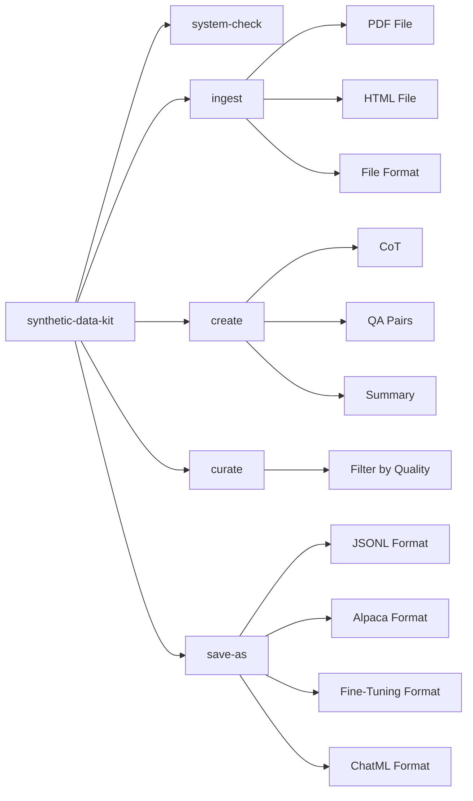

# Synthetic Data Kit

Tool for generating high-quality synthetic datasets to fine-tune LLMs.

Generate Reasoning Traces, QA Pairs, save them to a fine-tuning format with a simple CLI.

> [Checkout our guide on using the tool to unlock task-specific reasoning in Llama-3 family](https://github.com/meta-llama/synthetic-data-kit/tree/main/use-cases/adding_reasoning_to_llama_3)

# What does Synthetic Data Kit offer? 

Fine-Tuning Large Language Models is easy. There are many mature tools that you can use to fine-tune Llama model family using various post-training techniques.

### Why target data preparation?

Multiple tools support standardized formats. However, most of the times your dataset is not structured in "user", "assistant" threads or in a certain format that plays well with a fine-tuning packages. 

This toolkit simplifies the journey of:

- Using a LLM (vLLM or any local/external API endpoint) to generate examples
- Modular 4 command flow
- Converting your existing files to fine-tuning friendly formats
- Creating synthetic datasets
- Supporting various formats of post-training fine-tuning

# How does Synthetic Data Kit offer it? 

The tool is designed to follow a simple CLI structure with 4 commands:

- `ingest`: Parse various file formats (PDF, HTML, DOCX, PPTX, TXT, YouTube URLs). Supports text-only and multimodal (text + image) extraction for supported formats.
- `create`: Generate synthetic fine-tuning data from your ingested text, such as Question/Answer (QA) pairs, QA pairs with Chain of Thought (CoT), or summaries.
- `curate`: Use an LLM as a judge to curate high-quality examples from the generated data.
- `save-as`: Save the curated data into various formats suitable for fine-tuning (JSONL, Alpaca, FT, ChatML), either as local files or Hugging Face datasets.

You can override any parameter or detail by either using the CLI or overriding the default YAML config.


### Installation

#### From PyPI

```bash
# Create a new environment

conda create -n synthetic-data python=3.10 

conda activate synthetic-data

pip install synthetic-data-kit
```

#### (Alternatively) From Source

```bash
git clone https://github.com/meta-llama/synthetic-data-kit.git
cd synthetic-data-kit
pip install -e .
```

To get an overview of commands type: 

`synthetic-data-kit --help`

### 1. Tool Setup

- The tool expects respective files to be put in named folders.

```bash
# Create directory structure
mkdir -p data/{pdf,html,youtube,docx,ppt,txt,output,generated,cleaned,final}
```

- You also need a LLM backend that you will utilize for generating your dataset, if using vLLM:

```bash
# Start vLLM server
# Note you will need to grab your HF Authentication from: https://huggingface.co/settings/tokens
vllm serve meta-llama/Llama-3.3-70B-Instruct --port 8000
```

### 2. Usage

The flow follows 4 simple steps: `ingest`, `create`, `curate`, `save-as`, please paste your file into the respective folder:

```bash
# Check if your backend is running
synthetic-data-kit system-check

# Parse a document to text (text-only)
synthetic-data-kit ingest docs/report.pdf
# This will save file to data/output/parsed/report.lance (text-only)

# Parse a document, extracting text and images (multimodal)
synthetic-data-kit ingest docs/presentation.pptx --multimodal
# This will save file to data/output/parsed/presentation.lance (with text and image columns)

# Generate QA pairs (default)
synthetic-data-kit create data/output/report.txt --type qa

OR 

# Generate Chain of Thought (CoT) reasoning examples
synthetic-data-kit create data/output/report.txt --type cot

# Both of these will save file to data/generated/report_qa_pairs.json

# Filter content based on quality
synthetic-data-kit curate data/generated/report_qa_pairs.json

# Convert to alpaca fine-tuning format and save as HF arrow file
synthetic-data-kit save-as data/cleaned/report_cleaned.json --format alpaca --storage hf
```
## Configuration

The toolkit uses a YAML configuration file (default: `configs/config.yaml`).

Note, this can be overridden via either CLI arguments OR passing a custom YAML file

```yaml
# Example configuration using vLLM
llm:
  provider: "vllm"

vllm:
  api_base: "http://localhost:8000/v1"
  model: "meta-llama/Llama-3.3-70B-Instruct"

generation:
  temperature: 0.7
  chunk_size: 4000
  num_pairs: 25

curate:
  threshold: 7.0
  batch_size: 8
```

or using an API endpoint:

```yaml
# Example configuration using the llama API
llm:
  provider: "api-endpoint"

api-endpoint:
  api_base: "https://api.llama.com/v1"
  api_key: "llama-api-key"
  model: "Llama-4-Maverick-17B-128E-Instruct-FP8"
```

### Customizing Configuration

Create a overriding configuration file and use it with the `-c` flag:

```bash
synthetic-data-kit -c my_config.yaml ingest docs/paper.pdf
```

## Examples

### Processing a PDF Document

```bash
# Ingest PDF
synthetic-data-kit ingest research_paper.pdf

# Generate QA pairs
synthetic-data-kit create data/output/research_paper.txt -n 30 --threshold 8.0

# Curate data
synthetic-data-kit curate data/generated/research_paper_qa_pairs.json -t 8.5

# Save in OpenAI fine-tuning format (JSON)
synthetic-data-kit save-as data/cleaned/research_paper_cleaned.json -f ft

# Save in OpenAI fine-tuning format (HF dataset)
synthetic-data-kit save-as data/cleaned/research_paper_cleaned.json -f ft --storage hf
```

### Multimodal Parsing

The `ingest` command supports a `--multimodal` flag for DOCX, PDF, PPTX, and HTML files. When this flag is used, the toolkit attempts to extract images alongside text.

**Output Format:**

-   If `--multimodal` is **not** used, or for unsupported file types (like TXT, YouTube), the output Lance dataset in `data/output/parsed/` will contain a single `text` column.
-   If `--multimodal` **is** used for a supported file type:
    -   The output Lance dataset will contain two columns:
        -   `text` (string): The extracted text content.
        -   `image` (binary): The raw image bytes (e.g., PNG, JPEG). This will be `None` (null) if no image is associated with a given text entry.

**Image-Text Association Heuristics:**

The association of images with text currently follows these heuristics:

-   **DOCX (`.docx`):** The *first image* found anywhere in the document is associated with *each text block* (paragraph or table cell text) extracted from the document. If no image is found in the document, the 'image' field will be `None` for all text entries.
-   **PDF (`.pdf`):** The *first image* encountered on a given page is associated with *all text extracted from that same page*. If a page contains no images, the 'image' field will be `None` for all text entries from that page. Text is grouped by page.
-   **PPTX (`.pptx`):** The *first image* found on a given slide is associated with *all text extracted from that same slide* (including title, content shapes, and notes). If a slide contains no images, the 'image' field will be `None` for that slide's text entry. Text is grouped by slide.
-   **HTML (`.html`, `.htm`):**
    -   Text from common content tags (e.g., `<p>`, `<h1>`-`<h6>`, `<li>`, `<td>`, `<span>`, `<blockquote>`) is extracted. These text entries usually have their 'image' field set to `None`.
    -   For `` tags:
        -   The `alt` attribute's text is extracted into the 'text' field. If no `alt` text is present, this field may be an empty string.
        -   The image itself is downloaded (handling data URIs, absolute, and relative URLs) and its bytes are stored in the 'image' field. If the image cannot be fetched, this field will be `None`.
    -   This typically results in some rows in the Lance dataset being text-centric (image is `None`) and others being image-centric (text is the `alt` text).

**Example of multimodal ingest:**

```bash
synthetic-data-kit ingest my_document.docx --multimodal
# Output: data/output/parsed/my_document.lance (with 'text' and 'image' columns)
```

### Processing a YouTube Video

```bash
# Extract transcript
synthetic-data-kit ingest "https://www.youtube.com/watch?v=dQw4w9WgXcQ"

# Generate QA pairs with specific model
synthetic-data-kit create data/output/youtube_dQw4w9WgXcQ.txt
```

### Processing Multiple Files

```bash
# Bash script to process multiple files
for file in data/pdf/*.pdf; do
  filename=$(basename "$file" .pdf)
  
  synthetic-data-kit ingest "$file"
  synthetic-data-kit create "data/output/${filename}.txt" -n 20
  synthetic-data-kit curate "data/generated/${filename}_qa_pairs.json" -t 7.5
  synthetic-data-kit save-as "data/cleaned/${filename}_cleaned.json" -f chatml
done
```

## Advanced Usage

### Custom Prompt Templates

Edit the `prompts` section in your configuration file to customize generation behavior:

```yaml
prompts:
  qa_generation: |
    You are creating question-answer pairs for fine-tuning a legal assistant.
    Focus on technical legal concepts, precedents, and statutory interpretation.
    
    Below is a chunk of text about: {summary}...
    
    Create {num_pairs} high-quality question-answer pairs based ONLY on this text.
    
    Return ONLY valid JSON formatted as:
    [
      {
        "question": "Detailed legal question?",
        "answer": "Precise legal answer."
      },
      ...
    ]
    
    Text:
    ---
    {text}
    ---
```

### Mental Model:



## Troubleshooting FAQs:

### vLLM Server Issues

- Ensure vLLM is installed: `pip install vllm`
- Start server with: `vllm serve <model_name> --port 8000`
- Check connection: `synthetic-data-kit system-check`

### Memory Issues

If you encounter CUDA out of memory errors:
- Use a smaller model
- Reduce batch size in config
- Start vLLM with `--gpu-memory-utilization 0.85`

### JSON Parsing Issues

If you encounter issues with the `curate` command:
- Use the `-v` flag to enable verbose output
- Set smaller batch sizes in your config.yaml
- Ensure the LLM model supports proper JSON output
- Install json5 for enhanced JSON parsing: `pip install json5`

### Parser Errors

- Ensure required dependencies are installed for specific parsers:
  - PDF: `pip install pdfminer.six`
  - HTML: `pip install beautifulsoup4`
  - YouTube: `pip install pytubefix youtube-transcript-api`
  - DOCX: `pip install python-docx`
  - PPTX: `pip install python-pptx`

## License

Read more about the [License](./LICENSE)

## Contributing

Contributions are welcome! [Read our contributing guide](./CONTRIBUTING.md)
